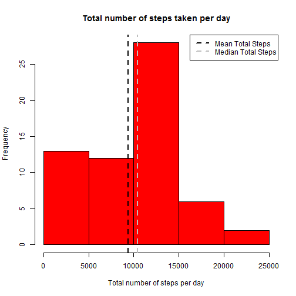
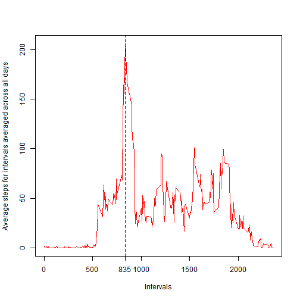
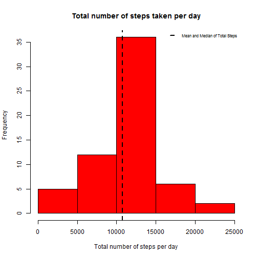
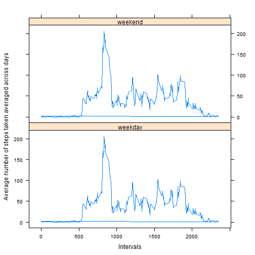
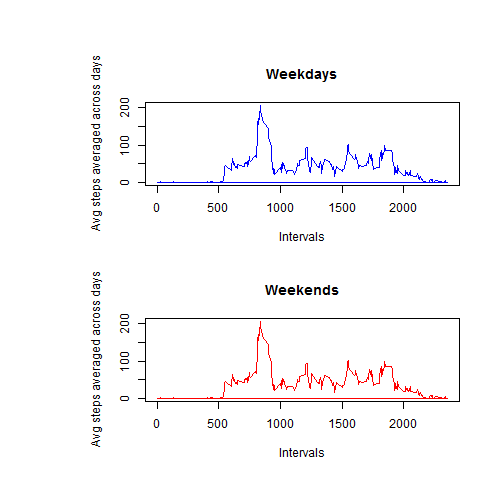

Peer Assignment 1
========================================================

_**Assumption**_ : The file "activity.csv" is located in the working directory

**Part 1 Reading and processing the data:**
The first step in the data analysis involves reading the data.
The following code chunk illustrates reading of data to R

```r
# Reading data
data <- read.table("activity.csv", stringsAsFactors = F, header = T, sep = ",")
```

Once successfully in R we start processing the data

```r
# Converting data$date to Date class
data$date <- as.Date(data$date, format = "%Y-%m-%d")

# Creating two new columns- one specifying the day of the week and other
# specifying if the given date is Weekend or weekday. We use ifWeekday()
# from timeDate package for this process
data$dayname <- weekdays(data$date)

data$day <- ""
library(timeDate)
for (i in 1:nrow(data)) {
    if (isWeekday(data[i, 2], wday = 1:5) == TRUE) {
        data[i, 5] <- "weekday"
    } else {
        data[i, 5] <- "weekend"
    }
}
data$day <- as.factor(data$day)

# Obtain a vector containing all the possible unique dates
uniqdates <- unique(data$date)

# Initialize a vector to calculate total steps per day
totsteps <- NULL
head(data)
```

```
##   steps       date interval dayname     day
## 1    NA 2012-10-01        0  Monday weekday
## 2    NA 2012-10-01        5  Monday weekday
## 3    NA 2012-10-01       10  Monday weekday
## 4    NA 2012-10-01       15  Monday weekday
## 5    NA 2012-10-01       20  Monday weekday
## 6    NA 2012-10-01       25  Monday weekday
```


**Part 2: Calculate the mean and median total steps and create a histogram of the total number of steps taken each day:**  
Once the data has been preprocessed we move towards calculating the total number of steps taken in a day. _The main assumption here is that missing values can be ignored._ Once calculated we plot a histogram of the total number of steps taken each day.

```r
for (j in 1:length(uniqdates)) {
    # The strategy here is to get a subset by a different date in every
    # iteration;then calculate its sum and store it.
    datatemp <- data
    datatemp <- datatemp[datatemp$date == uniqdates[j], ]
    totsteps[j] <- sum(datatemp$steps, na.rm = T)
}
# Calculate mean total steps
meantotsteps <- mean(totsteps)
meantotsteps
```

[1] 9354

```r
# Calculate the median total steps
medtotsteps <- median(totsteps)
medtotsteps
```

[1] 10395

**_Hence the Mean of total steps is 9354 and the median total of steps is 10395._**
Now plotting this in a histogram

```r
hist(totsteps, col = "red", xlab = "Total number of steps per day", main = "Total number of steps taken per day")
abline(v = meantotsteps, col = "black", lty = 2, lwd = 2)
abline(v = medtotsteps, col = "grey", lty = 2, lwd = 2)
legend("topright", col = c("black", "grey"), legend = c("Mean Total Steps", 
    "Median Total Steps"), lwd = 2, lty = 2)
```

 


**Part 3: Plot 5-minute interval (x-axis) and the average number of steps taken, averaged across all days (y-axis) and find the interval with the maximum number of steps:**
We start by computing average steps taken in every 5 minute intervals, averaged across all days. Since the intervals repeat every day we create buckets of intervals and compute the mean for each bucket._We use this information to determine the 5-minute interval, on average across all the days in the dataset, contains the maximum number of steps_

```r
# Initiate a vector that stores all the unique possible inteval values
interv <- unique(data$interval)
# Intitiate a vector to store the means of step taken across each unique
# interval
intervalmean <- NULL
# Initiate a loop that fills intervalmean with the mean number of steps
# averaged across all days.
for (z in 1:length(interv)) {
    datatemp1 <- data
    # The strategy here is to subset based on the 5 minute interals and then
    # calculate the means.
    datatemp1 <- datatemp1[which(datatemp1$interval == interv[z]), ]
    intervalmean[z] <- mean(datatemp1$steps, na.rm = T)
}

# Finding the inerval with the highest mean by finding the index of the
# highest mean.
intervmax <- interv[which(intervalmean == max(intervalmean))]
intervmax
```

[1] 835

We can thus see that the interval with maximum steps on average across all days is **_835_**

Now that we have the required data we start plotting it

```r

plot(interv, intervalmean, type = "l", col = "red", xlab = "Intervals", ylab = "Average steps for intervals averaged across all days ")
# Plotting the interval with maximum value interval indicated by the blue
# line
abline(v = intervmax, col = "blue", lty = 2)
axis(1, intervmax)
```

 


**Part 4: Imputing the NA values:**
Calculating the total number of NA values in the data. We know from preprocessing of file that the only column with NA values is the steps column

```r
table(is.na(data$steps))
```


FALSE  TRUE 
15264  2304 


We can clearly see that the a total of _2304_ value are missing in the data

The strategy I have chosen is to replace the NA values is to replace them with the means of 5 minute intervals they fall in.This is implemented using the following code

```r
newdata <- data
for (i in 1:nrow(newdata)) {
    if (is.na(newdata[i, 1])) {
        index <- NULL
        index <- which(newdata[i, 3] == interv)
        newdata[i, 1] <- intervalmean[index]
    }
}
```


Once the new dataframe is ready we can now calculate the new mean and median values for total number of steps taken per day

```r
# Since all the unique possible date values don't change we can use
# uniqdates from Part 1
totstepsnew <- NULL
for (j in 1:length(uniqdates)) {
    datatemp3 <- newdata
    datatemp3 <- datatemp3[datatemp3$date == uniqdates[j], ]
    totstepsnew[j] <- sum(datatemp3$steps)
}
# Calculate mean total steps
meantotstepsnew <- mean(totstepsnew)
meantotstepsnew
```

[1] 10766

```r
# Calculate the median total steps
medtotstepsnew <- median(totstepsnew)
medtotstepsnew
```

[1] 10766

PLotting the histogram below

```r
hist(totstepsnew, col = "red", xlab = "Total number of steps per day", main = "Total number of steps taken per day")
abline(v = meantotstepsnew, col = "black", lty = 2, lwd = 2)
legend("topright", col = c("black"), legend = c("Mean and Median of Total Steps"), 
    lwd = 2, lty = 2, bty = "n", cex = 0.7)
```

 


_Hence the Mean and Median of the total of steps are both **10766.19** and thus greater than mean and median of original data ._ As a result of this strategy we can see that the mean and the median here have same values. Hence this new distribution is less skewed in nature than the older one. In other words the NA imputing strategy has made this distribution **_more normal_** in nature than in previous case which was slightly skewed to the left. Since mean and median are equal they are represented by a single line in the plot. 


**Part 5: Observing the differences in activity patterns between weekdays and weekends: **
We proceed to studying the differences in activity patterns between weekdays and weekends using lattice plotting system
We start by calculating the average number of steps taken, averaged across all days

```r
# Since all the unique possible inteval values don't change we can use
# interv from Part 2

# Intitiate a vector to store the means of step taken across each unique
# interval
intervalmeannew <- NULL
# Initiate a loop that fills intervalmean with the mean number of steps
# averaged across all days.
for (z in 1:length(interv)) {
    datatemp4 <- newdata
    datatemp4 <- datatemp4[which(datatemp4$interval == interv[z]), ]
    intervalmeannew[z] <- mean(datatemp4$steps)
}


intervmaxnew <- interv[which(intervalmeannew == max(intervalmeannew))]
intervmaxnew
```

[1] 835

```r
max(intervalmeannew)
```

[1] 206.2

We notice that maximum value and the interval with maximum value both remain unchanged with respect to the previous case


```r
temp <- as.data.frame(cbind(interval = interv, intervalmeannew))

library(plyr)
newdata1 <- join(newdata, temp, by = "interval")


library(lattice)
xyplot(intervalmeannew ~ interval | day, newdata1, type = "l", layout = c(1, 
    2), xlab = "Intervals", ylab = "Average number of steps taken averaged across days")
```

 

Since the result seems a little unusual we can verify it by plotting it in the base plotting system. The first step involves sub-setting newdata1 to newdata2(for weekdays) and newdata3(for weekends)

```r
newdata2 <- newdata1[newdata1$day == "weekday", ]
newdata3 <- newdata1[!newdata1$day == "weekday", ]
par(mfcol = c(2, 1), oma = c(2, 6, 3, 1))
plot(newdata2$interval, newdata2$intervalmeannew, type = "l", col = "blue", 
    main = "Weekdays", xlab = "Intervals", ylab = "Avg steps averaged across days")
plot(newdata3$interval, newdata3$intervalmeannew, type = "l", col = "red", main = "Weekends", 
    ylab = "Avg steps averaged across days", xlab = "Intervals")
```

 

This proves that the results of the panel plots were correct. _Thus the NA imputing strategy has filled the data in such a way that the plots for activity patterns between weekdays and weekends are almost identical._ 
